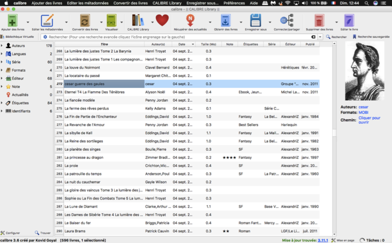
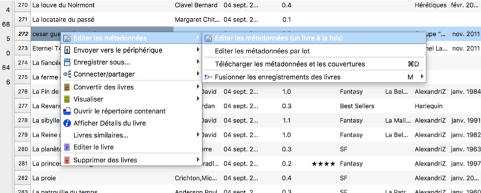
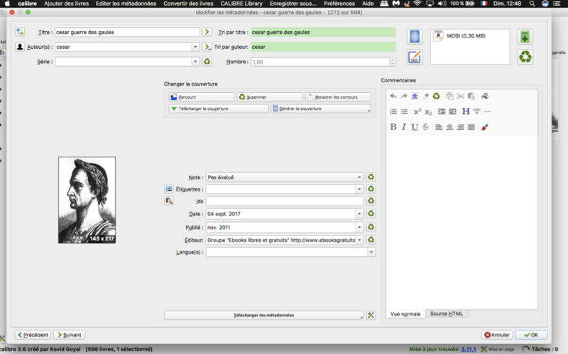
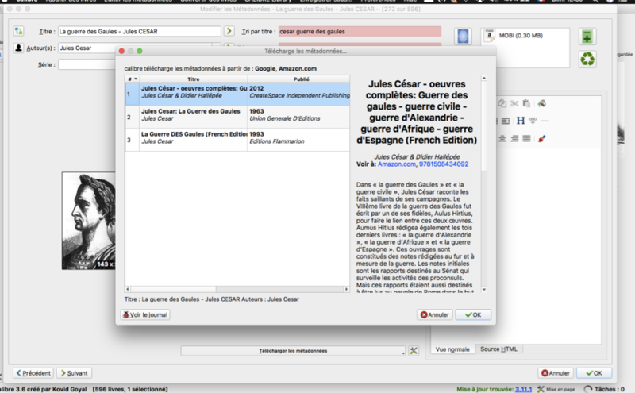
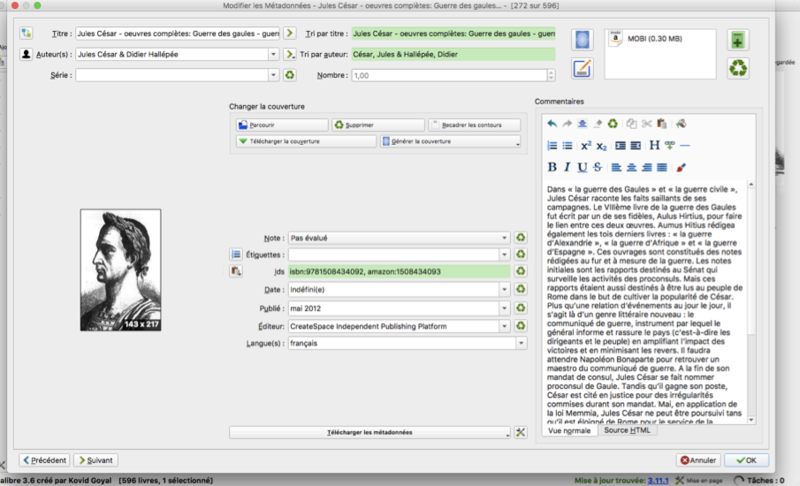
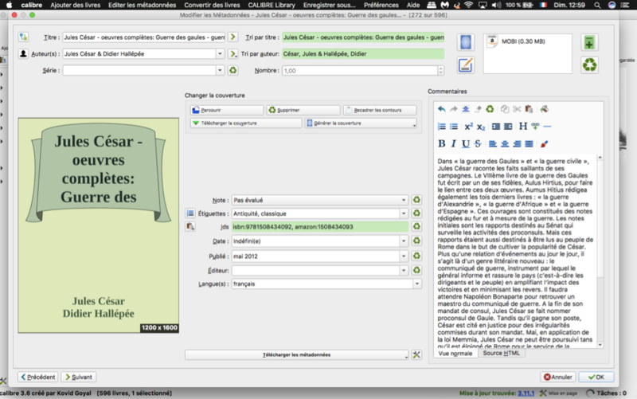
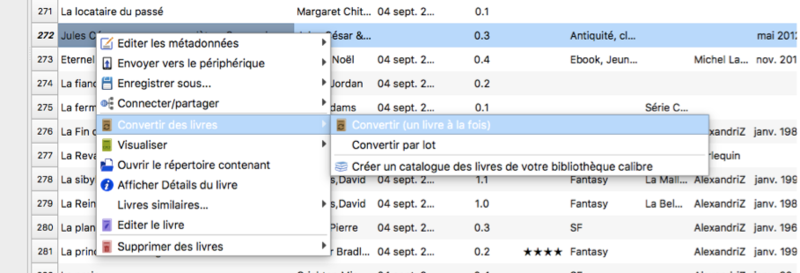
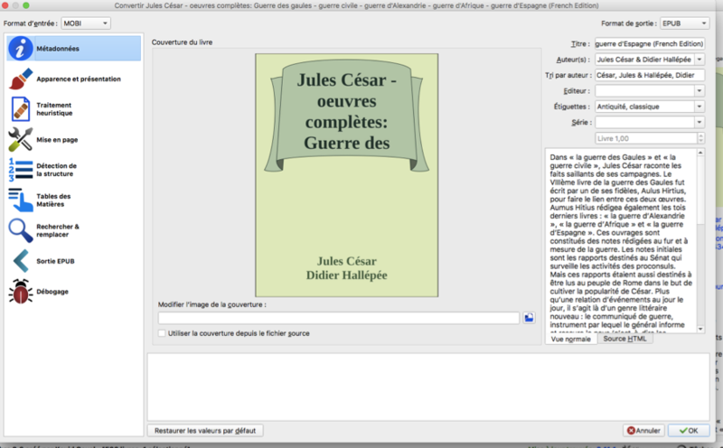

#Créer un fichier epub à l’aide de Calibre

**Niveau** : Débutant

**Auteur** : Chloé Lalouette

**Date de MàJ** : 05/11/2017

**Licence** : CC-bySA

##Principes - Ce que nous allons faire

Créer un fichier epub en choisissant ses métadonnées à l’aide d’un fichier de livre électronique (pdf, mobi, epub…)

##Ingrédients - Ce dont nous avons besoin

Logiciel Calibre (gratuit, disponible pour Windows, Mac OS et Linux)

Document électronique (format de livre électronique ou pdf)

##Étapes - Comment allons-nous procéder ?

Ouvrir Calibre.

Ajouter le fichier choisi. 

Pour cela, trois options : Tirer le fichier directement dans la fenêtre du logiciel ; utiliser le bouton « Ajouter un livre » en haut à droite, ou bien passer par le menu déroulant « Ajouter un livre » de la barre des tâches et sélectionner le fichier choisi. 

Avec un clic droit sur le livre choisi, sélectionner « Editer les métadonnées » et « un livre à la fois » (si vous modifiez les métadonnées pour un jeu entier de fichiers, elles seront appliquées simultanément à tous les livres sélectionnés de manière identique).

Vous arrivez désormais sur la fenêtre des métadonnées du livre. Vous pouvez choisir de les remplir manuellement, ou utiliser l’option « télécharger les métadonnées ». Si des métadonnées sont trouvées sur Internet (Amazon, Google…), le choix des différentes possibilités vous est proposé.

En validant à l’aide du bouton OK, les métadonnées du modèle choisi seront appliquées à votre fichier.

Vous pouvez modifier ce qui ne vous convient pas dans le jeu de métadonnées trouvées si vous le souhaitez.
Vous pouvez également choisir de changer la couverture du livre si celles proposées dans les métadonnées trouvées ne vous conviennent pas, soit en téléchargeant la couverture de votre choix à l’aide du bouton « parcourir » à partir de votre ordinateur, soit en générant une nouvelle couverture aléatoire.

Les étiquettes vous permettent d’ajouter des tags à votre livre afin de le retrouver plus facilement lors de vos recherches.

Validez lorsque vous êtes satisfait de vos données.

Le livre choisi doit ensuite être converti en format epub.
Pour ce faire, effectuez de nouveau un clic droit sur l’ouvrage, et sélectionnez « Convertir des livres » et « un livre à la fois » (Si vous avez plusieurs fichiers à transformer, vous pouvez également répéter pour chacun la première partie concernant les métadonnées, puis les convertir par lot par la suite).

Vous arrivez sur une nouvelle fenêtre comprenant plusieurs onglets ; pour cette manipulation simple, le premier suffit. Le format d’entrée (ici MOBI) est indiqué en haut à gauche. Le format de sortie est indiqué en haut à droite. Vous pouvez le changer en fonction de ce que vous souhaitez, ici nous laisseront EPUB qui est le format le plus intéressant pour un livre électronique.
Vous pouvez encore si vous le souhaitez modifier la couverture à partir de cette fenêtre.

Enfin, en validant, la conversion de votre fichier se lance automatiquement, avec les nouvelles métadonnées, il ne vous reste plus qu’à le transférer sur votre appareil de lecture si vous le souhaitez en « envoyant sur le périphérique » si celui-ci est branché.

Bonne lecture!

##En savoir plus

[Aide de Calibre](https://calibre-ebook.com/fr/help)